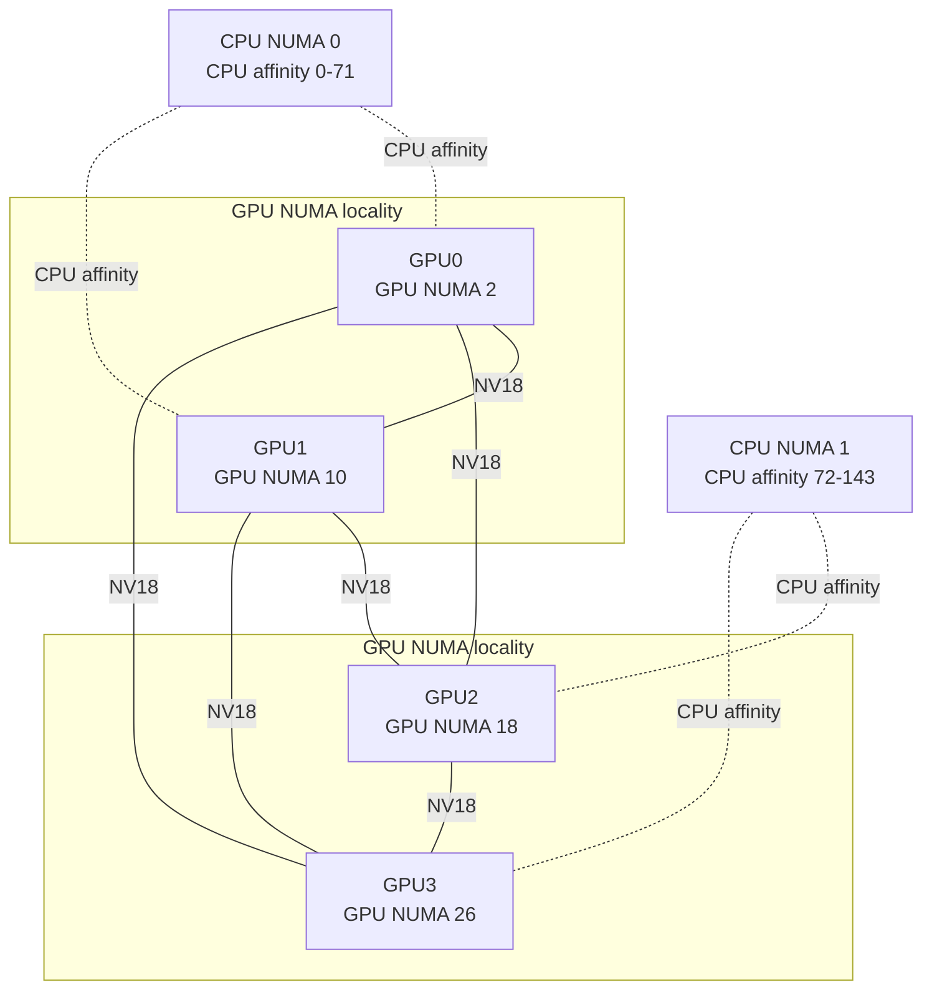

```
SW/HW mapping
```


```
$ nvcc hello.cu -o hello -lcudart -lnccl

$ ~/cuda-intro$ ./hello

Number of Device 1
 SMP Count 72
 Number of Thread per SMP 1536
 Max Block per SMP 16
 Register per SM 65536
 Shared Memory per SM 102400
 Shared Memory per Block 101376
 Warp size (Number of threads per Warp) 32
 Clock Rate 1.695
 Warp Capacity 48
```
```
SMP Count on 1 GPU (SMP Count 72)
```


```
Number of Block per SMP (Max Block per SMP 16)
```


```
Number of warps per SM (warp capacity 48)
Most GPUs have four warp schedulers per SM.
```


```
1 Warp Slot (number of threads per warp: 32)
```


```
Kernel Launch <<<1, 1024>>>
```


```
Kernel Launch <<< 72, 1024>>>
```


```
Kernel Launch <<< 1, 64>>>
will use 1 SM and 2 warps (32 threads each)
```


```
Kernel Launch <<<256, 512>>>

## Occupancy accounting: `<<<256, 512>>>` on NVIDIA A10 (sm_86)

| Level               | Count   | Derivation                                    |
|---------------------|---------|-----------------------------------------------|
| Total threads       | 131,072 | 256 blocks × 512 threads                      |
| Total warps         | 4,096   | 131,072 / 32                                  |
| Warps per block     | 16      | 512 / 32                                      |
| Blocks per SM       | 3       | ⌊1536 / 512⌋ — thread limit binds             |
| Warps per SM        | 48      | 3 × 16 = SM max → 100% theoretical occupancy  |
| Warps per scheduler | 12      | 48 / 4 sub-partitions                         |
| Waves               | ~1.19   | 256 / (72 SMs × 3 blocks)                     |

### Resource thresholds to sustain 3 blocks/SM

| Resource       | SM pool  | Threshold per block      | If exceeded          |
|----------------|----------|--------------------------|----------------------|
| Registers      | 65,536   | ≤ 42 regs/thread         | 2 blocks → 66% occ.  |
| Shared memory  | 102,400 B| ≤ ~33 KB                 | 2 blocks → 66% occ.  |
| Block slots    | 16       | n/a (3 ≪ 16)             | not binding          |

```


```
Basic understanding of
blockDim.x, blockId.x and threadIdx.x

```


```
Basic understanding of
blockDim.y, blockId.y and threadIdx.y
```


## NVIDIA GPU topology

Captured with `nvidia-smi topo -m` on four NVIDIA GB300 GPUs. Every GPU pair is connected by `NV18`.



`NV18` means a bonded set of 18 NVLinks. `X` on the `nvidia-smi topo -m` diagonal is the GPU's self-connection.
